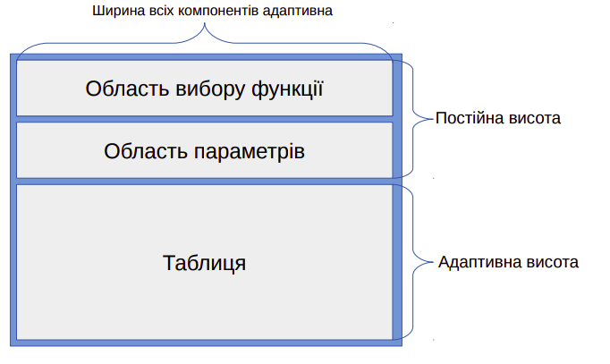

# Лабораторная №2

Розробити інтерфейс програми для обчислення таблиці значень обраної користувачем функції. Користувач має обирати одну з можливих альтернатив функції для обчислення, вводити інтервал (початок і кінець) і кількість точок на інтервалі. Програма повинна з рівномірним кроком обчислити значення функції та заповнити ними таблицю на екранній формі. Якщо у деякі точці виникне виключна ситуація, пов’язана з розривом функції, то за допомогою механізму обробки таких ситуації вивести відповідне повідомлення. Необхідно забезпечити контроль за коректністю введених даних: ліва границя менша за праву границю інтервалу (дійсні числа), кількість точок більша або рівна 2. Інтерфейс повинен бути адаптивним до розмірів екранної форми за наступною схемою:

